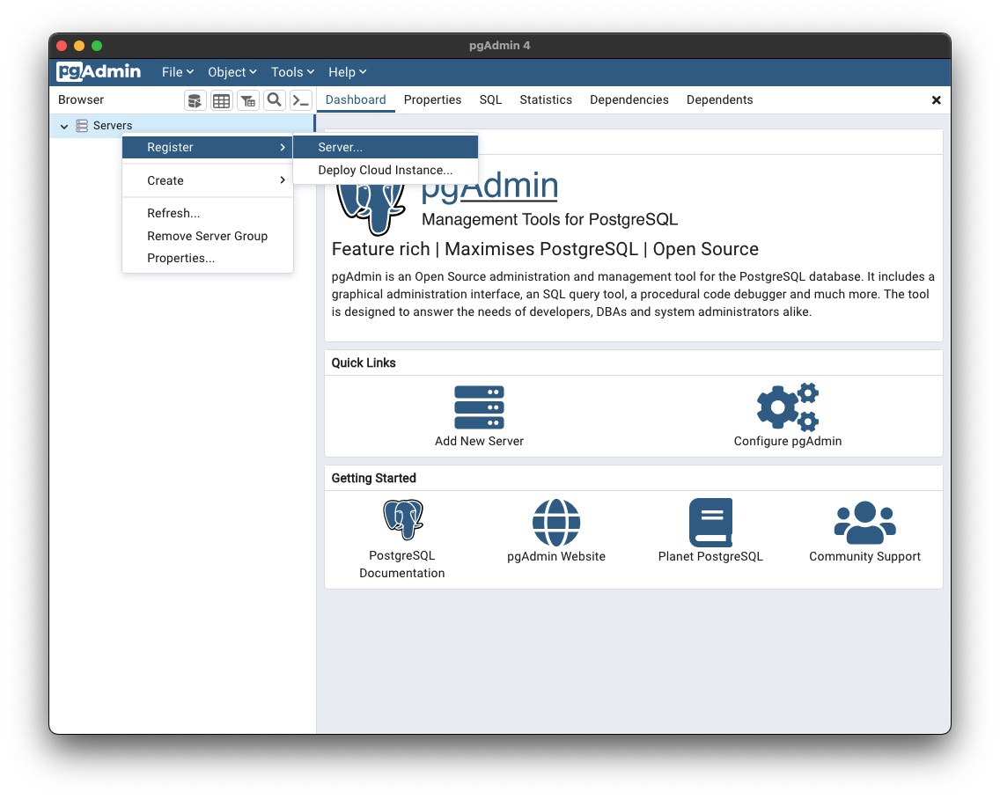
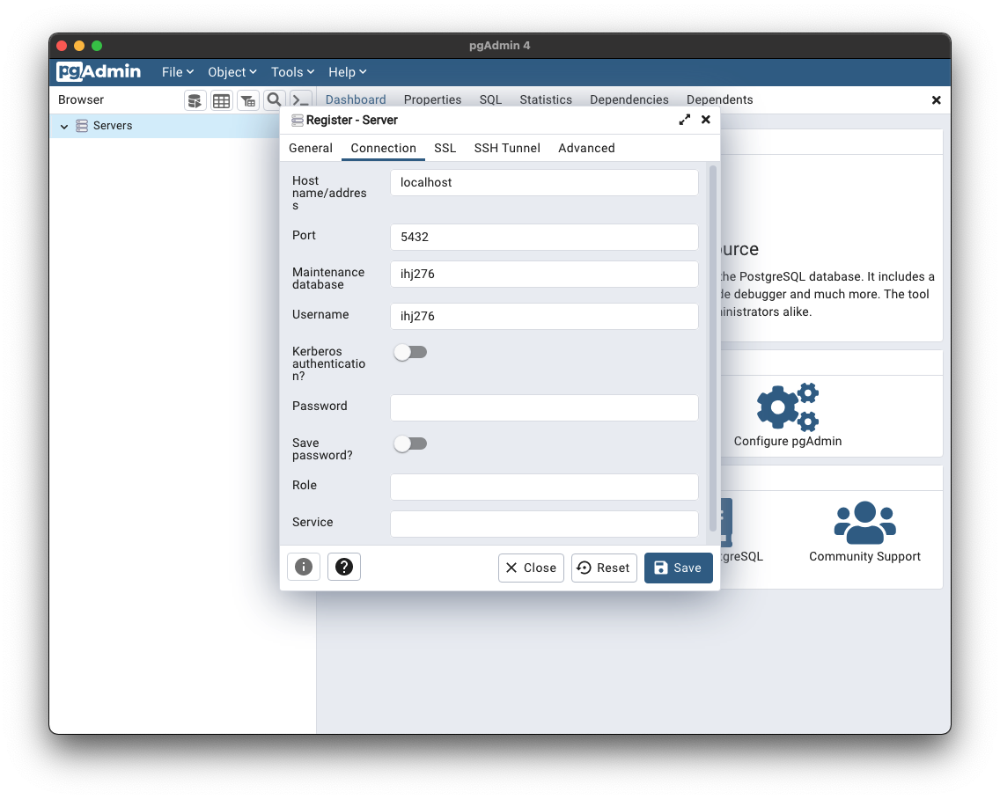
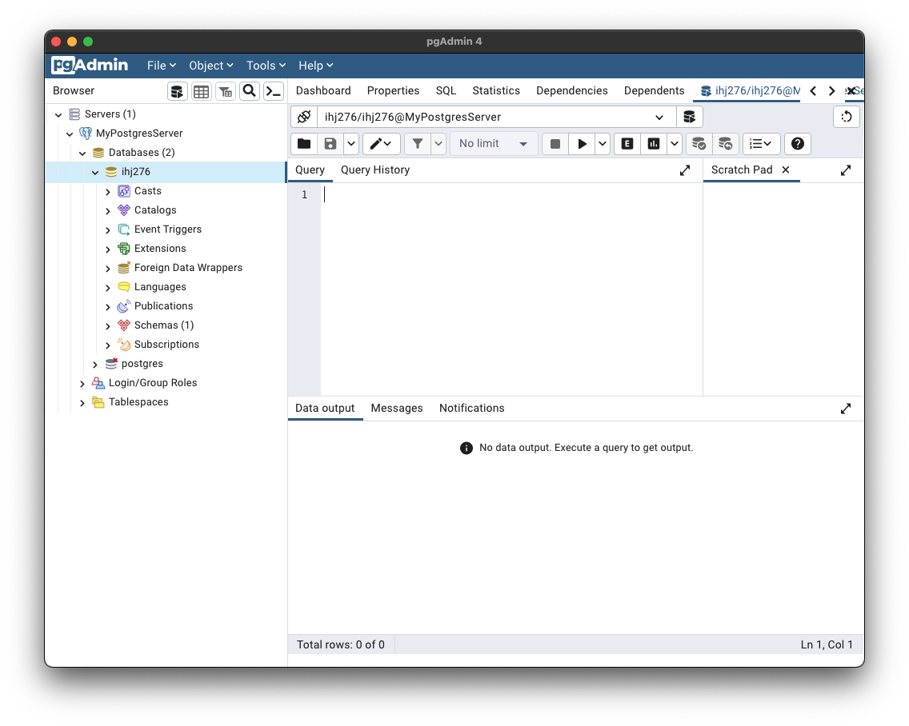

# Lab 1: SQL and PostgreSQL

## Step 1: Run PostgreSQL and PgAdmin

**Start your local PostgreSQL server.**

<details>
<summary>Mac</summary>
<br/>

1. Open *Postgres.app*.

    

2. Click *Initialize*.

    

3. The server is now running with the following default settings:

    - Host: `localhost`
    - Port: `5432`
    - User: *Your system username*
    - Database: *Your system username*
    - Password: *None*
    - Connection URL: `postgresql://localhost`

</details>
<br/>

**Open PgAdmin.**

1. Open *PgAdmin*.

    

2. Right-click *Servers* and select *Register > Server*.

    

3. Give your server a name (I name mine *MyPostgresServer*).

    

4. Enter the connection information.

    

5. Click *Save*. You should now see your new server in the *Servers* list on the left.

    

6. For Steps 2 and 3 we will use the *Query Tool*. Click the *Query Tool* button (see below) to open it.

    

    

## Step 2: Create a Table

*Note:* This [Quick SQL Cheatsheet](https://github.com/enochtangg/quick-SQL-cheatsheet) is an excellent resource and you should definitely bookmark it.

Our first task is to create a table. To do that, we use a command `CREATE TABLE`.

Our table will contain Users. Users will have an ID, a first name, and a last name.

```sql
--- CREATE TABLE tells Postgres to create a table. After that we have the table name "users".
--- The columns are defined in parentheses.
CREATE TABLE users (
    --- Columns are defined like <column name> <data type> <constraints> (columns);
    --- The user_id is our table's PRIMARY KEY, which identifies each row. It must be unique and not null.
    --- The SERIAL data type tells Postgres to automatically populate this column with an auto-incrementing `INTEGER` value.
    user_id SERIAL PRIMARY KEY,
    --- The first_name column is a VARCHAR type (basically a string). We could say VARCHAR(n) to limit the number of characters to n.
    --- NOT NULL means a value for the column must always be specified.
    first_name VARCHAR NOT NULL,
    last_name VARCHAR NOT NULL
);
```

Let's say we want to add a column for who reports to whom. We can do this with `ALTER TABLE`.

```sql
--- ALTER TABLE <table name> ADD COLUMN <column name> <data type> <constraints>;
ALTER TABLE users ADD COLUMN reports_to INT;
```

### Knowledge Check

Notice that we are using an `INTEGER` for the `reports_to` column. Why?

<details>
<summary>Answer</summary>
<br/>

The value for `reports_to` will be the `user_id` of the respective user's manager.
The `user_id` should never change, but `first_name` and `last_name` can.
</details>
<br/>

Can `reports_to` be null?

<details>
<summary>Answer</summary>
<br/>

Yes. We did not add the `PRIMARY KEY` constraint (because we already have one) and we did not add a `NOT NULL` constraint.
</details>
<br/>

## Step 3: Create, Read, Update, and Delete Row Data

### Create a user

To create a user, we use `INSERT`.

```sql
--- INSERT INTO table(columns) VALUES (column values)
INSERT INTO users(first_name, last_name) VALUES ('John', 'Smith');
```

To see the results, we use `SELECT`.

```sql
--- SELECT columns FROM table;
--- * is a wildcard meaning return all columns.
SELECT * FROM users;
```

We should see something like this:

| `user_id` | `first_name`  | `last_name`   | `reports_to`
|---        |---            |---            |---
| `1`       | `John`        | `Smith`       | *null*

Notice that `user_id` has been populated automatically but `reports_to` has not.

To just see specific columns, we list them after `SELECT`. For example:

```sql
SELECT first_name, last_name FROM users;
```

returns:

| `first_name`  | `last_name`
|---            |---
| `John`        | `Smith`

Now let's create a user who reports to John.

```sql
--- INSERT INTO table(columns) VALUES (column values)
INSERT INTO users(first_name, last_name, reports_to) VALUES ('Matt', 'Jones', 1);
SELECT * from users;
```

### Update a user

John hires two more employees. Let's add them to the table.

```sql
INSERT INTO users(first_name, last_name, reports_to) VALUES ('Jennifer', 'Williams', 1);
SELECT * from users;
```

Jennifer says they prefer to use "Jenny" as their first name. We can update their first name using `UPDATE`.

```sql
--- UPDATE table SET column = value WHERE condition
UPDATE users SET first_name = 'Jenny' WHERE user_id = 3;
SELECT * from users;
```

### Delete a user

Matt wins the lottery and resigns. Let's remove him from the table.

```sql
--- DELETE FROM table WHERE condition
DELETE FROM users WHERE user_id = 2;
SELECT * from users;
```

Why are we using `user_id` as our condition?

<details>
<summary>Answer</summary>
<br/>

We only want to delete Matt from our table, so we use the ID because it is guaranteed to be unique and not null.

We can use any condition, however, and may delete multiple rows at once. `DELETE` should be used with caution!
</details>
<br/>

### Query users

Add the following users to the table:

```sql
INSERT INTO users (first_name, last_name, reports_to) VALUES ('Stacey', 'Milton', 1);
INSERT INTO users (first_name, last_name, reports_to) VALUES ('Devan', 'Raines', 1);
INSERT INTO users (first_name, last_name, reports_to) VALUES ('Andile', 'Perry', 1);
INSERT INTO users (first_name, last_name, reports_to) VALUES ('Fumnanya', 'Giffard', 1);
INSERT INTO users (first_name, last_name, reports_to) VALUES ('Derby', 'Travis', 3);
INSERT INTO users (first_name, last_name, reports_to) VALUES ('Parker', 'Hudson', 3);
INSERT INTO users (first_name, last_name, reports_to) VALUES ('Ola', 'Willis', 3);
INSERT INTO users (first_name, last_name, reports_to) VALUES ('Kelechi', 'Warwick', 3);
INSERT INTO users (first_name, last_name, reports_to) VALUES ('Cedar', 'Owston', 5);
INSERT INTO users (first_name, last_name, reports_to) VALUES ('Avery', 'Ljungman', 5);
SELECT * from users;
```

*Note:* Previously John's user ID was `2`. When we added more users, `2` was not reused.

Find all of John's direct reports.

```sql
--- Our condition is reports_to = 1 (John)
SELECT * FROM users WHERE reports_to = 1;
```

Find how many users report to Jenny.

To do this, we can use `COUNT()`.

```sql
SELECT COUNT(*) FROM users WHERE reports_to = 3;
```

### Update multiple users

Let's say Devan leaves the company. His direct reports will shift to Ola.

```sql
UPDATE users SET reports_to = ? WHERE reports_to = ?;
SELECT * FROM users;
```

<details>
<summary>Answer</summary>
<br/>

```sql
UPDATE users SET reports_to = 10 WHERE reports_to = 5;
SELECT * FROM users;
```
</details>
<br/>

### Cleanup

To `TRUNCATE` our table means to leave the table structure in place and delete all of the rows.

```sql
--- TRUNCATE table;
TRUNCATE users;
SELECT * FROM users;
```

The table will be empty.

To `DROP` the table means to completely remove the table and its rows.

```sql
--- DROP TABLE table;
DROP TABLE users;
SELECT * FROM users;
```

Since we dropped the table, we'll get an error here.

```
ERROR:  relation "users" does not exist
```

### Knowledge Check

What would this row item look like as a JSON object?

| `user_id` | `first_name`  | `last_name`   | `reports_to`
|---        |---            |---            |---
| `1`       | `John`        | `Smith`       | *null*

<details>
<summary>Answer</summary>
<br/>

```json
{
    "user_id": 1,
    "first_name": "John",
    "last_name": "Smith",
    "reports_to": null
}
```
</details>
